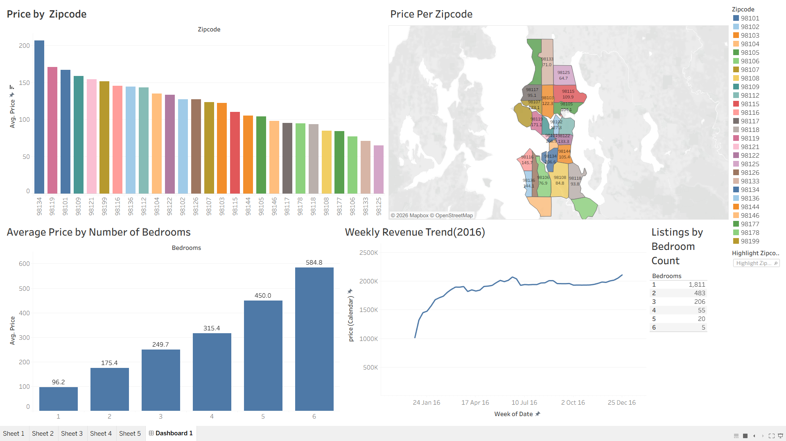

# 📊 Airbnb Market Analysis Dashboard

An interactive Tableau dashboard that analyzes Airbnb pricing trends, revenue patterns, and listing characteristics using the **Airbnb Listings 2016 Dataset**. The dashboard enables users to explore the data through interactive visualizations and filters to uncover meaningful business insights.

---

## 📌 Project Overview

This project focuses on analyzing Airbnb listing data to identify pricing trends, revenue patterns, and location-based insights. Using Tableau, an interactive dashboard was developed to help users explore the dataset and gain a better understanding of the Airbnb market.

---

## 🎯 Objective

The main objective of this project is to:

- Analyze Airbnb listing prices across different zip codes.
- Compare average prices based on the number of bedrooms.
- Visualize weekly revenue trends.
- Explore geographic variations in Airbnb pricing.

---

## 🛠️ Tools & Technologies

- 📊 Tableau Public
- 🔗 Inner Join
- 📁 Airbnb Listings 2016 Dataset (Kaggle)

---

## 🗃️ Dataset

**Dataset:** Airbnb Listings 2016 Dataset

The dataset consists of multiple tables, including:

- 🏠 Listings
- 📅 Calendar
- 💬 Reviews

> **Note:** This project uses only the **Listings** and **Calendar** tables.

**Dataset Source:**
https://www.kaggle.com/datasets/alexanderfreberg/airbnb-listings-2016-dataset

---

## 🔗 Data Modeling

To prepare the data for analysis in Tableau:

- Connected the **Listings** and **Calendar** tables.
- Performed an **Inner Join** to combine listing information with calendar pricing and availability data.
- Used the combined dataset as the data source for creating the dashboard.

---

## 📈 Dashboard Features

- 💰 Average Price by Zipcode
- 🗺️ Price Distribution Map
- 🛏️ Average Price by Bedroom Count
- 📊 Weekly Revenue Trend
- 🎛️ Interactive Filters for Bedrooms and Zipcodes

---

## 🔍 Key Insights

- 📍 Average Airbnb prices vary across different zip codes.
- 🏠 Properties with more bedrooms generally have higher average prices.
- 📈 Weekly revenue trends provide insights into pricing over time.
- 🌍 Geographic location has a significant impact on Airbnb pricing.

---

## 💼 Skills Demonstrated

- 📊 Tableau Dashboard Development
- 🔗 Data Modeling using Inner Join
- 📈 Data Visualization
- 🗺️ Geographic Analysis
- 📖 Data Storytelling
- 🎛️ Interactive Dashboard Design

---

## 📷 Dashboard Preview


```markdown

```

---

## 🌐 Live Dashboard

**Tableau Public**

https://public.tableau.com/app/profile/megha.harikumar.p/viz/AirbnbProject_17846152231800/Dashboard1

---

## 📂 Repository Structure

```
Airbnb-Market-Analysis-Dashboard/
│
├── AirbnbDashboard.twbx
├── dashboard.png
└── README.md
```

---

## 🚀 Future Enhancements

- Add additional KPI cards for quick insights.
- Include dashboard actions for improved interactivity.
- Expand the analysis using the Reviews dataset.
- Explore seasonal pricing and availability trends.

---

## 👩‍💻 Author

**Megha Harikumar P**

📊 Tableau Public: *https://public.tableau.com/app/profile/megha.harikumar.p*

---

## ⭐ If you found this project interesting, feel free to star the repository!
